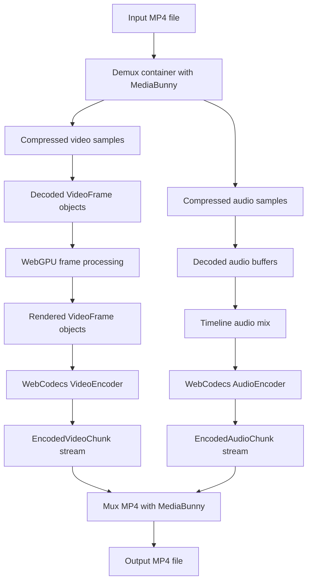
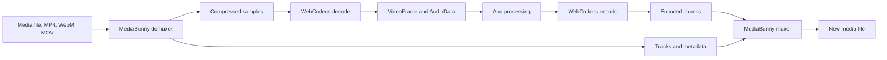
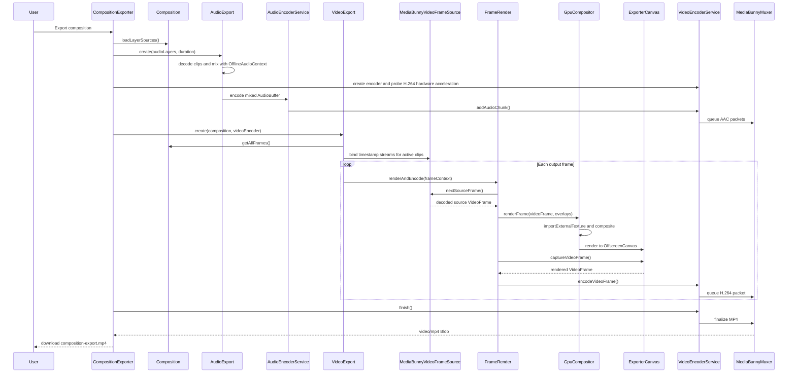

# WebCodecs: Browser-Native Video Decode, Processing, and Export

In the previous article, [WebGPU is the secret weapon for browser video processing](https://www.linkedin.com/pulse/webgpu-secret-weapon-browser-video-processing-alexsandro-souza-8u9gf/), I focused on the GPU side of browser media work: importing decoded frames into WebGPU, running shader passes, and keeping expensive pixel processing away from JavaScript loops.

That is still the right mental model for effects and compositing.

But GPU processing is only one part of a real media pipeline. A video tool also needs to read compressed files, decode video and audio, preserve timestamps, process frames, encode the result, mux the encoded streams into a container, and produce something the user can actually download.

That is where WebCodecs changes the shape of browser video work.

WebCodecs gives web applications direct access to browser media primitives such as `VideoFrame`, `AudioData`, `VideoEncoder`, `AudioEncoder`, `EncodedVideoChunk`, and `EncodedAudioChunk`. Instead of treating video as only an HTML media element or a canvas trick, an application can work with frames and encoded chunks directly. When the browser, operating system, codec, and hardware support it, those encode and decode operations can use platform hardware acceleration.

The companion demo for this article is available on GitHub: [apssouza22/webgpu-video-encoding](https://github.com/apssouza22/webgpu-video-encoding).

The demo is intentionally small, but it walks through the full loop:

1. Open MP4 media in the browser.
2. Decode video frames and audio samples.
3. Composite the visual timeline with WebGPU.
4. Capture rendered frames as `VideoFrame` objects.
5. Encode video with WebCodecs.
6. Mix and encode audio with Web Audio and WebCodecs.
7. Mux H.264 and AAC chunks into an MP4 with MediaBunny.
8. Download the final file locally.

For the purposes of the demo, everything runs locally in the browser: no native application, no server-side renderer, and no backend FFmpeg job. The goal is to show how far modern browser APIs can take us when WebCodecs, WebGPU, Web Audio, and MediaBunny are combined carefully.

## The Media Pipeline

Developers often talk about "a video file" as if it were one thing. Internally, it is a set of related pieces.

An MP4 file is a container. It usually contains at least one video track and often one or more audio tracks. Those tracks contain compressed samples. The video samples might be H.264 or HEVC. The audio samples might be AAC. Those compressed samples are not directly useful for pixel processing or audio mixing.

To process media, the app has to move through a pipeline:



WebCodecs is responsible for the codec parts of that diagram: turning decoded frames into encoded chunks, and in lower-level pipelines, turning encoded chunks back into decoded frames. It is not a complete media file toolkit by itself.

That distinction matters.

WebCodecs works with frames, audio data, and encoded chunks. It does not parse every container format, manage an editing timeline, mix audio tracks, or write a finished MP4 file by itself. For those parts, the companion demo uses MediaBunny.

MediaBunny handles the file and container work: opening an MP4, finding tracks, exposing video samples and audio buffers, converting encoded chunks into muxable packets, and writing the final MP4.

The browser media stack becomes much more useful when these responsibilities are separated:

- MediaBunny handles containers, tracks, samples, and muxing.
- WebCodecs handles video and audio compression.
- Web Audio handles timeline audio mixing.
- WebGPU handles visual processing and compositing.
- The app coordinates timing, layers, progress, cleanup, and download.

## What MediaBunny Brings to the Browser

[MediaBunny](https://mediabunny.dev/) is worth introducing carefully because it solves one of the least obvious problems in browser media development.

WebCodecs gives the browser direct access to codec primitives, but codecs are not files. A `VideoFrame` is not an MP4. An `EncodedVideoChunk` is not an MP4 either. The same is true for audio: `AudioData` and `EncodedAudioChunk` are useful building blocks, but they are not a complete media container.

MediaBunny fills that gap. It is a JavaScript media toolkit for reading, writing, and converting media files directly in the browser. The official docs describe it as a bit like FFmpeg, but built for the web's needs. That comparison is useful as long as you keep the scope clear: MediaBunny is not a shell command wrapped in JavaScript. It is a TypeScript library built around modern browser media APIs, with a focus on containers, tracks, samples, muxing, demuxing, and high-level workflows.

At its core, MediaBunny provides multiplexers and demultiplexers.

A demultiplexer reads a container and exposes what is inside it: metadata, tracks, compressed samples, timestamps, codec parameters, and media data.

A multiplexer does the opposite. It takes encoded media data and writes a new container file with the right track metadata and timing information.

That makes MediaBunny a natural partner for WebCodecs:



In practical terms, MediaBunny helps with the work that sits around WebCodecs:

- It opens media from browser-friendly sources such as `Blob` objects.
- It understands containers like MP4 and WebM.
- It discovers video and audio tracks.
- It exposes duration, dimensions, sample rate, channel count, and codec information.
- It can read video samples at specific timestamps.
- It can provide audio data as `AudioBuffer` chunks.
- It converts WebCodecs encoded chunks into muxable packets.
- It writes the final MP4 container.

The demo uses only a focused slice of what MediaBunny can do, but that slice is exactly what a browser video exporter needs.

For input, it creates an `Input` from a fetched `Blob`:

```ts
const input = new Input({
  source: new BlobSource(await response.blob()),
  formats: ALL_FORMATS,
});
```

For video, it asks MediaBunny for the primary video track and creates a `VideoSampleSink`:

```ts
const videoTrack = await input.getPrimaryVideoTrack();
const sink = new VideoSampleSink(videoTrack);
```

For audio, it asks for the primary audio track and reads decoded buffers through `AudioBufferSink`:

```ts
const audioTrack = await input.getPrimaryAudioTrack();
const sink = new AudioBufferSink(audioTrack);
```

For output, it creates an MP4 `Output`, adds H.264 and AAC packet sources, then writes encoded chunks into the container:

```ts
const format = new Mp4OutputFormat({ fastStart: 'in-memory' });
const output = new Output({ format, target: new BufferTarget() });

const videoSource = new EncodedVideoPacketSource('avc');
output.addVideoTrack(videoSource, { frameRate: fps });
```

That is the role MediaBunny plays in this architecture: it turns browser codec primitives into a usable media-file workflow.

## Decode: From File to Frames

Decoding is the process of turning compressed media into data the app can use.

For video, that means producing `VideoFrame` objects. A `VideoFrame` represents an image at a specific point in media time. It has a timestamp, a duration, dimensions, and underlying pixel data managed by the browser.

For audio, decoding means producing sample data. In the demo, audio clips become `AudioBuffer` objects that can be scheduled, mixed, and later converted into `AudioData` for encoding.

The hard part is that video files are not just arrays of independent images. Modern codecs use inter-frame compression. Some frames depend on earlier or later frames. Seeking to a timestamp can require finding a nearby keyframe and decoding forward. Timestamps matter because the app needs frame 87 at the correct time, not just "the next image."

The sample implementation wraps the video side in `MediaBunnyVideoFrameSource`:

```ts
const input = new Input({
  source: new BlobSource(await response.blob()),
  formats: ALL_FORMATS,
});

const videoTrack = await input.getPrimaryVideoTrack();
const sink = new VideoSampleSink(videoTrack);
```

Once the track is open, the app can request a frame for a timeline timestamp:

```ts
const sample = await sink.getSample(clampTimestamp(timestamp));
const frame = sample.toVideoFrame();
```

For export, it also uses a streaming path:

```ts
for await (const sample of sink.samplesAtTimestamps(timestamps)) {
  yield wrapSample(sample);
}
```

That is important for deterministic export. Before rendering, `VideoExport` builds the list of output frame contexts. Each active `VideoClip` binds a frame stream for exactly the timestamps it needs. Export then walks the timeline in order and asks for the next decoded frame.

The composition model provides the timing layer:

```ts
const time = frame / fps;
const frameContext = composition.getFrameContextAtTime(time, frame);
```

Each `VideoFrameContext` contains the active video and image clips for that timestamp, plus the output timestamp in microseconds. That timestamp is later passed to the encoded output frame so the final MP4 has coherent timing.

## MediaBunny Makes Decode Practical

WebCodecs gives developers low-level codec access, but real files still need container handling.

An MP4 has metadata, tracks, sample tables, codec parameters, durations, timestamps, and packet ordering. A serious app does not want to rebuild all of that by hand before it can even reach a `VideoFrame`.

MediaBunny simplifies that layer. In the demo it is used to:

- Open local MP4 files from fetched `Blob` objects.
- Discover primary video and audio tracks.
- Check whether a video track can be decoded by the browser.
- Read video samples at specific timestamps.
- Convert video samples into `VideoFrame` objects.
- Read audio track data into `AudioBuffer` chunks.
- Build the final MP4 container from encoded H.264 and AAC chunks.

That lets the implementation focus on the editing pipeline instead of container internals. The app still controls its own timeline, rendering, audio scheduling, and export progress, but it does not need to hand-write MP4 parsing or MP4 writing logic.

The video decode wrapper stays small because MediaBunny does the file work:

```ts
const videoTrack = await input.getPrimaryVideoTrack();

if (!(await videoTrack.canDecode())) {
  const codec = await videoTrack.getCodecParameterString();
  throw new Error(`Browser cannot decode video track${codec ? ` (${codec})` : ''}`);
}

return new MediaBunnyVideoFrameSource(
  input,
  new VideoSampleSink(videoTrack),
  await input.computeDuration(),
  videoTrack.displayWidth,
  videoTrack.displayHeight,
);
```

The key point is that MediaBunny does not replace WebCodecs. It complements it. MediaBunny gets the app to the right media samples and writes the final container. WebCodecs handles the encode and decode primitives exposed by the browser.

## Process: Where WebGPU Fits

After decode, the app has usable video frames. That does not mean JavaScript should manipulate pixels directly.

A 1280x720 frame has more than 900,000 pixels. A 4K frame has more than 8 million. If every frame is copied into JavaScript-visible memory and processed in loops, the app quickly spends its time moving and touching memory instead of doing useful media work.

This is where WebGPU still matters.

WebCodecs gets frames in and out of the media pipeline. WebGPU does the expensive visual work between those two points.

In the demo, a decoded source frame enters the compositor as a `VideoFrame`. The compositor imports it as an external texture:

```ts
const externalVideoTexture = device.importExternalTexture({
  source: videoFrame,
});
```

Image overlays are uploaded as GPU textures:

```ts
device.queue.copyExternalImageToTexture(
  { source: image },
  { texture },
  { width, height },
);
```

Then a WGSL shader composites the base video and active overlays into a WebGPU canvas texture. The shader samples the base frame, samples the overlay, checks whether the current UV is inside the overlay rectangle, applies opacity, and writes the result.

For preview, the render target is a visible `HTMLCanvasElement`.

For export, the render target is an `OffscreenCanvas` with a WebGPU context:

```ts
const canvas = new OffscreenCanvas(width, height);
const context = canvas.getContext('webgpu');

context.configure({
  device,
  format: navigator.gpu.getPreferredCanvasFormat(),
  alphaMode: 'premultiplied',
});
```

After rendering, the export path captures the canvas as a new `VideoFrame`:

```ts
await device.queue.onSubmittedWorkDone();

const renderedFrame = new VideoFrame(canvas, {
  timestamp: timestampMicros,
  duration: durationMicros,
  alpha: 'discard',
});
```

That `VideoFrame` becomes the input to `VideoEncoder`.

This is the bridge that makes the architecture interesting:


The app does not use WebGPU instead of WebCodecs. It uses WebGPU with WebCodecs. Decode gives the app frames. WebGPU processes those frames. Encode compresses the processed result.

## Encode: From Frames to Compressed Video

Encoding is the reverse direction: turning raw or rendered frames into compressed media chunks.

In WebCodecs, video encoding starts with `VideoEncoder`. The app creates an encoder, gives it an `output` callback, configures it with codec settings, then feeds it `VideoFrame` objects.

The sample implementation wraps that logic in `VideoEncoderService`:

```ts
this.encoder = new VideoEncoder({
  output: (chunk, meta) => {
    this.muxer.addVideoChunk(chunk, meta);
  },
  error: (error) => {
    throw error;
  },
});

this.encoder.configure(config);
```

The `output` callback receives `EncodedVideoChunk` objects. These are compressed H.264 chunks, not MP4 files. They still need to be muxed into a container later.

Before configuring the encoder, it probes supported H.264 configurations:

```ts
const support = await VideoEncoder.isConfigSupported(candidate);

if (support.supported) {
  const config = support.config ?? candidate;
  return { config, codec: config.codec ?? codec };
}
```

The exporter tries several `avc1.*` codec strings and hardware acceleration preferences. That is not just defensive programming. Browser codec support depends on browser, operating system, hardware, and installed platform codecs. A configuration that works on one machine may fail on another.

The selected config includes the output size, bitrate, frame rate, latency mode, bitrate mode, and sometimes a hardware acceleration preference:

```ts
const base = {
  width,
  height,
  bitrate,
  framerate: fps,
  latencyMode: 'quality',
  bitrateMode: 'variable',
};
```

Hardware acceleration is one of the most important performance details in a browser export pipeline.

Encoding H.264 in software can be expensive, especially at higher resolutions or long durations. Modern machines often have dedicated media blocks for video encode and decode. WebCodecs can route work to those platform encoders when available, which means the export can avoid doing all compression work on general-purpose CPU cores.

The exporter does not assume one fixed acceleration mode. It tries a small preference list:

```ts
const HARDWARE_PREFERENCES = [
  undefined,
  'prefer-hardware',
  'prefer-software',
  'no-preference',
];
```

Each preference is combined with each H.264 codec candidate:

```ts
const candidate = {
  ...base,
  codec,
  ...(hardwareAcceleration ? { hardwareAcceleration } : {}),
};

const support = await VideoEncoder.isConfigSupported(candidate);
```

That gives the browser room to pick the best supported path. On one system, `prefer-hardware` might be accepted and backed by a platform encoder. On another system, the same codec profile might only work in software. On another, a different `avc1.*` profile may be required.

The important lesson is to treat hardware acceleration as a capability to probe, not a guarantee. WebCodecs exposes the option, but support is shaped by browser implementation, OS media frameworks, installed codecs, GPU drivers, and sometimes power or security policy.

Each rendered frame is encoded with its timeline timestamp and duration already attached:

```ts
encoder.encode(frame, {
  keyFrame: frameIndex % fps === 0,
});
```

The demo marks one keyframe per second. Keyframes are larger, but they make the encoded video easier to seek and recover from. A production editor would likely make this configurable.

The exporter also respects encoder backpressure:

```ts
if (encoder.encodeQueueSize >= maxEncodeQueueSize) {
  await waitForEncoderDrain(encoder);
}
```

This matters for long exports. Encoding is asynchronous. If the app pushes frames faster than the browser can compress them, memory usage grows and responsiveness suffers. A good browser export pipeline needs to treat `encodeQueueSize` as a real signal.

Finally, export finishes by flushing and closing the encoder:

```ts
await encoder.flush();
encoder.close();
```

`flush()` tells WebCodecs to finish all pending encode work. Only after that is it safe to finalize the MP4.

## Audio: Decode, Mix, Encode

Video gets most of the attention, but audio is not optional in a real export.

Audio has its own timing model. It is sample-based, not frame-based. A 48 kHz audio track has 48,000 samples per second per channel. If the output timeline is 30 fps, each video frame is 33.333 ms, but audio continues as a steady stream of samples.

The demo treats audio clips as explicit timeline layers:

```ts
composition
  .addLayer(new AudioClip('/samples/video.mp4', 0, 5))
  .addLayer(new AudioClip('/samples/video-2.mp4', 5));
```

Each audio clip opens the MP4 through MediaBunny, finds the primary audio track, and reads buffers from an `AudioBufferSink`:

```ts
const audioTrack = await input.getPrimaryAudioTrack();
const sink = new AudioBufferSink(audioTrack);

for await (const wrapped of sink.buffers(startTime, endTime)) {
  // Copy decoded samples into the clip buffer.
}
```

For export, `AudioExport` mixes all active audio clips into one timeline buffer with `OfflineAudioContext`:

```ts
const offlineContext = new OfflineAudioContext(
  channels,
  frameCount,
  sampleRate,
);

source.buffer = buffer;
source.connect(offlineContext.destination);
source.start(clip.start, 0, clipDuration);

const mixed = await offlineContext.startRendering();
```

This is a good use of Web Audio. The app can schedule clips at their timeline positions and let the browser render a deterministic mixed buffer offline.

After mixing, it encodes the audio with `AudioEncoder` using AAC:

```ts
this.encoder.configure({
  codec: 'mp4a.40.2',
  sampleRate,
  numberOfChannels: channels,
  bitrate,
});
```

The mixed `AudioBuffer` is converted into chunks of interleaved `Float32Array` data. Each chunk becomes an `AudioData` object:

```ts
const audioData = new AudioData({
  format: 'f32',
  sampleRate,
  numberOfFrames: frameSamples,
  numberOfChannels: channels,
  timestamp,
  data: frameData,
});

encoder.encode(audioData);
audioData.close();
```

The timestamp is advanced according to the number of samples encoded:

```ts
timestamp += Math.round((frameSamples / sampleRate) * 1_000_000);
```

That microsecond timestamp keeps audio aligned with the video timeline when both streams are muxed into the final MP4.

AAC support is checked at runtime:

```ts
const support = await AudioEncoder.isConfigSupported({
  codec: 'mp4a.40.2',
  sampleRate: 48000,
  numberOfChannels: 2,
  bitrate: 192_000,
});
```

If the browser cannot encode AAC, the demo can still export video-only. That is an important practical detail: WebCodecs is powerful, but codec availability is not uniform across all browsers.

## Muxing: Encoded Chunks Are Not a Video File

After encoding, the app has compressed video chunks and compressed audio chunks.

It still does not have an MP4.

An MP4 container needs track metadata, timing tables, codec descriptions, sample ordering, and final file structure. WebCodecs intentionally does not do that job. It gives the app encoded media chunks. Another layer has to package them.

The sample implementation uses `MediaBunnyMuxer` for that layer:

```ts
const format = new Mp4OutputFormat({ fastStart: 'in-memory' });
this.output = new Output({ format, target: this.target });

this.videoSource = new EncodedVideoPacketSource('avc');
this.output.addVideoTrack(this.videoSource, { frameRate: fps });
```

When audio is available, it adds an AAC track:

```ts
this.audioSource = new EncodedAudioPacketSource('aac');
this.output.addAudioTrack(this.audioSource);
```

Encoded WebCodecs chunks are converted into MediaBunny packets:

```ts
const packet = EncodedPacket.fromEncodedChunk(chunk).clone({
  sequenceNumber: nextVideoSequenceNumber++,
});

await videoSource.add(packet, meta);
```

The same pattern applies to audio chunks. When all chunks have been written, the muxer closes the tracks and finalizes the output:

```ts
videoSource.close();
audioSource?.close();
await output.finalize();
```

The final result is an `ArrayBuffer`, which becomes a downloadable MP4 `Blob`:

```ts
return new Blob([buffer], {
  type: 'video/mp4',
});
```

This is the part many WebCodecs examples skip. Encoding a chunk is not the same thing as exporting a file. If you want a normal MP4 that can be downloaded, uploaded, or played elsewhere, you need muxing.

## The Project Export Flow

Putting the pieces together, the export has two major flows: an audio flow that prepares AAC chunks, and a video flow that renders and encodes every output frame.



The flow is deliberately explicit. Export is not a single browser API call. It is a pipeline of decode, timing, rendering, encoding, muxing, and cleanup.

## Practical Lessons for Developers

The first practical lesson is to separate frames from files.

WebCodecs gives access to frames and chunks. A media file is a container around encoded tracks. If your app needs to open MP4s and write MP4s, pair WebCodecs with a container library like MediaBunny.

The second lesson is to treat timestamps as part of the data.

Video frames need timestamps. Audio data needs timestamps. Encoded chunks need to preserve timing. If timestamps drift, the final file may play, but audio sync, seeking, or frame ordering can break.

The third lesson is to probe codec support.

Do not assume H.264, AAC, hardware acceleration, or a specific `avc1.*` string will work everywhere. Use `VideoEncoder.isConfigSupported()` and `AudioEncoder.isConfigSupported()` before export starts, then show useful errors or fall back to video-only when appropriate.

The fourth lesson is to respect backpressure.

`VideoEncoder.encode()` is asynchronous. If `encodeQueueSize` grows, wait. Otherwise long exports can create memory pressure and unpredictable behavior.

The fifth lesson is to close media resources.

`VideoFrame`, `AudioData`, decoded samples, encoders, and MediaBunny inputs all own resources. Close them when they are no longer needed. Browser-native media APIs are powerful, but they are not garbage-free abstractions.

The sixth lesson is to avoid full-frame JavaScript pixel work in the hot path.

Use WebCodecs to decode and encode. Use WebGPU to process visual frames. Use Web Audio to mix audio. JavaScript should coordinate the pipeline, not become the pixel engine.

## Why This Matters

The browser already has the best distribution model in software: open a URL and run.

The missing piece has been serious media capability. For a long time, browser video tools had to choose between limited client-side processing or a server-side render farm.

WebCodecs changes that by exposing codec primitives directly to applications. MediaBunny makes those primitives practical for real files. WebGPU gives the browser a high-throughput processing stage between decode and encode.

Together, they make a local-first media pipeline possible:

- Decode MP4 video and audio in the browser.
- Process frames with GPU shaders.
- Encode H.264 video and AAC audio with WebCodecs.
- Mux the result into an MP4.
- Download the final file without sending media to a server.

The companion demo is still a focused experiment, not a complete editor. It currently composites one active video layer with image overlays, mixes explicit audio layers, and exports a 1280x720 MP4. More advanced timelines would need transitions, multiple video layers, text, masks, color pipelines, worker scheduling, and broader codec handling.

But the core architecture is already visible.

Use MediaBunny to understand files.

Use WebCodecs to encode and decode media.

Use WebGPU to process pixels efficiently.

Use Web Audio to handle audio timelines.

Use JavaScript to orchestrate the whole thing.

That combination is what makes modern browser media development interesting. The browser is no longer just a place to play video. It is becoming a serious runtime for building video tools.
