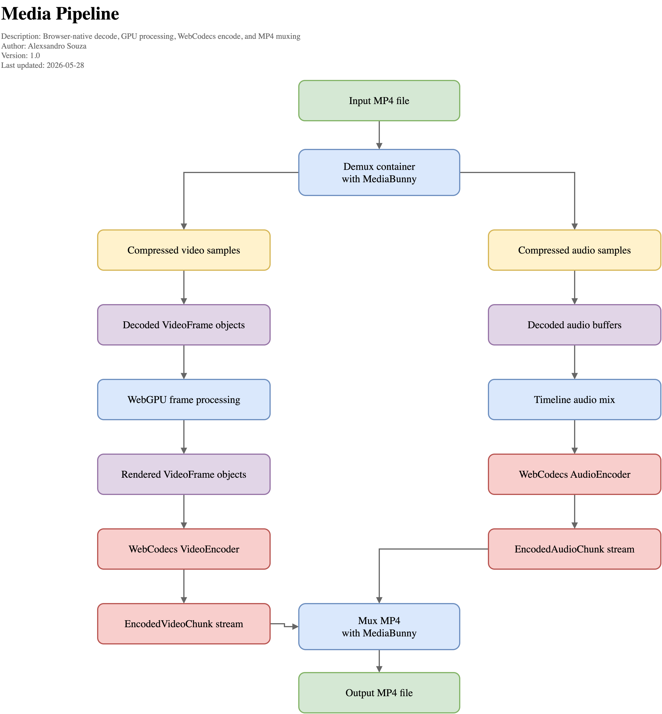

# gpu-video-export

An experimental browser project for exploring high-performance video processing with **WebGPU**.

The goal is to understand how far a browser-native video pipeline can go when
composition work stays on the GPU: decode media frames, combine multiple visual
layers, preview the timeline, render export frames through an `OffscreenCanvas`,
encode with WebCodecs, and mux the result into an MP4.

For a longer write-up on browser-native video decode, processing, encoding,
and MP4 export with WebCodecs, WebGPU, and MediaBunny, read
[ARTICLE.md](./ARTICLE.md).



This is not a full editor. It is a focused playground for testing the building
blocks of a GPU-powered video compositor.

## What it does

In a supported desktop browser (Chrome/Edge recommended), the app:

1. Loads a timeline-style composition with ordered **video**, **image overlay**, and **audio** layers
2. Composes video and image layers with a **WebGPU shader**
3. Shows an interactive WebGPU preview player with play/pause controls, audio playback, and a scrubber
4. Renders export frames on a **WebGPU OffscreenCanvas** (no `readPixels` CPU fallback)
5. Captures each rendered frame as a **`VideoFrame`** from the canvas
6. Encodes video with **`VideoEncoder`** (H.264 / WebCodecs)
7. Encodes audio with **`AudioEncoder`** (AAC / WebCodecs) when supported
8. Muxes everything to **MP4** with **MediaBunny**
9. Downloads `composition-export.mp4` when export finishes

The demo composition is 1280x720 at 30 fps. It plays `video.mp4` for the first 5 seconds, switches to `video-2.mp4`,
schedules explicit audio layers from the same files for preview playback, and displays two transparent image overlays
from 1s to 4s. Export mixes the timeline audio layers when browser AAC support is available.

## Why WebGPU?

Video composition is naturally GPU-shaped work. Each frame can be treated as a
set of textures: a base video frame plus overlays, transforms, opacity, and later
effects. WebGPU gives the browser direct access to a modern graphics pipeline, so
this project keeps rendering on the GPU for both preview and export instead of
copying pixels back through the CPU.

The current compositor is intentionally small: it composites one active video
layer with any active image overlays. The structure is meant to grow toward more
video layers, transitions, effects, and timeline behavior while keeping the same
GPU-first export path.

## Composition API

Compositions are built from ordered clip layers. A frame context exposes the
active clips at a timeline time, and active video clips can decode their next
source frame from that context.

```ts
import { AudioClip, Composition, ImageClip, VideoClip } from './src/composition';

const composition = new Composition(30, 1280, 720, {
  outputFilename: 'composition-export.mp4',
});

composition
  .addLayer(new VideoClip('/samples/video.mp4', 0, 5))
  .addLayer(new VideoClip('/samples/video-2.mp4', 5))
  .addLayer(new AudioClip('/samples/video.mp4', 0, 5))
  .addLayer(new AudioClip('/samples/video-2.mp4', 5))
  .addLayer(new ImageClip('/samples/overlay.png', 1, 3, 0.62, 0.08, 0.32, 0.32, 0.92));

const frame = composition.getFrameContextAtTime(2.5);
const sourceFrame = await frame.videos[0]?.nextSourceFrame();
```

## Requirements

- Browser with **WebGPU**, **WebCodecs** (`VideoEncoder`, `AudioEncoder`), and `VideoFrame(OffscreenCanvas)`
- **Chrome or Edge (desktop)** recommended — Safari/Firefox often lack H.264 `VideoEncoder` support; the app probes several `avc1.*` profiles automatically
- Sample media in `public/samples/`:
  - `video.mp4` — first video clip, ideally with an audio track
  - `video-2.mp4` — second video clip, ideally with an audio track
  - `overlay.png` — transparent PNG shown on the right side from 1s to 4s
  - `overlay-2.png` — transparent PNG shown on the left side from 1s to 4s
- MediaBunny dependency is currently resolved from `../MasterSelects/node_modules/mediabunny`; adjust `package.json` if you want to install it from npm or another local path

## Quick start

```bash
npm install
# copy your files:
#   public/samples/video.mp4
#   public/samples/video-2.mp4
#   public/samples/overlay.png
#   public/samples/overlay-2.png
npm run dev
```

Open http://localhost:5180. The app checks sample media, loads the preview player, then enables **Export composition**. Press the button to render and download the MP4.

## License

MIT (demo code)
